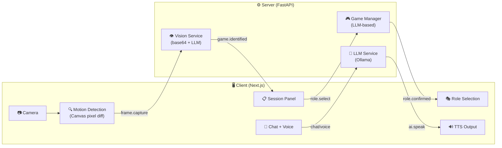

# Board Game AI - 오프라인 보드게임 AI 어시스턴트

카메라로 보드판을 인식하고, 로컬 LLM으로 게임을 이해하며, 음성과 텍스트로 소통하는 AI 어시스턴트입니다.

## 주요 기능

- **WebSocket 실시간 통신** — 양방향 메시지 기반 아키텍처. 서버가 능동적으로 이벤트를 푸시합니다.
- **클라이언트 모션 감지** — Canvas 픽셀 차분 알고리즘으로 보드 변화를 감지하고, 안정화 후 자동 캡처합니다.
- **LLM 기반 게임 인식** — 하드코딩 없이 LLM의 학습 지식으로 보드게임 종류를 식별합니다. 새 게임 추가 시 코드 변경이 불필요합니다.
- **AI 역할 시스템** — DM(진행자), Player(조언자), Referee(심판), Observer(관전자) 중 선택.
- **음성 입출력** — Browser Web Speech API 기반 STT/TTS. 별도 패키지 설치 없이 동작합니다.
- **로컬 AI** — Ollama(Llama 3 + Llava)로 프라이버시를 보장하고 오프라인에서 작동합니다.

## 아키텍처



## 필수 요구사항

- **Node.js** v18+
- **Python** v3.9+
- **Ollama** — [다운로드](https://ollama.com/)

## 설치

### 1. Ollama 모델 다운로드

```bash
ollama pull llama3    # 텍스트 추론/대화
ollama pull llava     # 이미지 분석
```

### 2. 서버

```bash
cd server
python3 -m venv venv
source venv/bin/activate
pip install -r requirements.txt
```

### 3. 클라이언트

```bash
cd client
npm install
```

## 실행

터미널 2개에서 각각 실행합니다.

```bash
# 터미널 1 - 서버
cd server
source venv/bin/activate
uvicorn main:app --reload --port 8000
```

```bash
# 터미널 2 - 클라이언트
cd client
npm run dev
```

브라우저에서 http://localhost:3000 에 접속합니다.

## 사용 방법

1. **Start Session** 클릭 → WebSocket 연결 + 세션 시작
2. 카메라를 보드게임에 비추고 **Monitor** 또는 **Snapshot** 클릭
3. AI가 게임을 인식하면 역할(DM/Player/Referee/Observer) 선택
4. 보드에 변화가 생기면 자동으로 캡처 → AI 분석
5. 채팅 또는 마이크 버튼으로 AI와 대화

## WebSocket 메시지 프로토콜

### Client → Server

| type | 설명 |
|------|------|
| `session.start` | 새 세션 시작 |
| `session.end` | 세션 종료 |
| `role.select` | AI 역할 선택 |
| `frame.capture` | 안정화 후 base64 이미지 전송 |
| `voice.input` | 음성 인식 텍스트 |
| `chat.input` | 텍스트 채팅 |
| `ping` | 연결 유지 |

### Server → Client

| type | 설명 |
|------|------|
| `session.created` | 세션 생성 확인 |
| `game.identified` | 게임 인식 결과 + 역할 추천 |
| `role.confirmed` | 역할 설정 확인 |
| `analysis.result` | 보드 분석 결과 |
| `ai.speak` | TTS 재생 요청 |
| `narration` | DM 나레이션 |
| `turn.alert` | 턴 변경 알림 |
| `error` | 에러 |
| `pong` | ping 응답 |
| `session.ended` | 세션 종료 + 요약 |

## 설정

### LLM 모델 변경

`server/config.py`에서 모델명을 수정합니다:

```python
TEXT_MODEL = "llama3:latest"    # 텍스트 모델
VISION_MODEL = "llava:latest"   # 비전 모델
```

### 모션 감지 민감도

`client/lib/constants.ts`에서 조절합니다:

```typescript
export const MOTION_THRESHOLD = 30;       // 픽셀 차이 임계값 (높이면 둔감)
export const MOTION_PIXEL_RATIO = 0.005;  // 변화 픽셀 비율 (높이면 둔감)
export const STABILITY_DELAY = 1500;      // 안정화 대기 시간 (ms)
```

## 프로젝트 구조

```
server/
  main.py                    # FastAPI + WebSocket 엔드포인트
  config.py                  # 설정 상수
  models/
    messages.py              # WS 메시지 모델 (Pydantic)
    session.py               # 게임 세션 데이터
  services/
    llm_service.py           # Ollama AsyncClient + 역할별 프롬프트
    vision_service.py        # base64 디코딩 + LLM 위임
    session_manager.py       # 세션 생명주기
    game_manager.py          # AI 기반 게임 관리
  handlers/
    websocket_handler.py     # WS 메시지 라우터

client/
  app/
    page.tsx                 # 메인 오케스트레이터
    layout.tsx               # 루트 레이아웃
  components/
    CameraView.tsx           # 카메라 + 모션 감지
    GameStatus.tsx           # 상태 표시 바
    SessionPanel.tsx         # 세션/역할 선택
  hooks/
    useWebSocket.ts          # WebSocket 연결 관리
    useMotionDetection.ts    # Canvas 모션 감지
  lib/
    types.ts                 # WS 프로토콜 타입
    constants.ts             # 설정 상수
  types/
    speech.d.ts              # Web Speech API 타입
```

## 기술 스택

| 영역 | 기술 |
|------|------|
| Frontend | Next.js 16, React 19, Tailwind CSS 4, TypeScript |
| Backend | Python 3.9, FastAPI, Pydantic |
| AI | Ollama (Llama 3 + Llava) |
| 통신 | WebSocket (양방향) |
| 음성 | Web Speech API (STT/TTS) |
| 모션 감지 | Canvas 2D pixel diff (클라이언트) |
